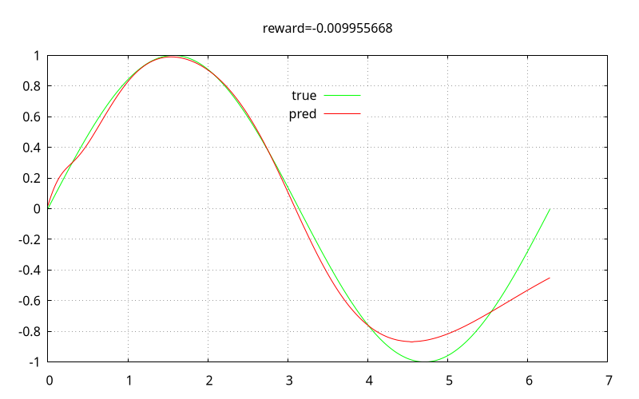
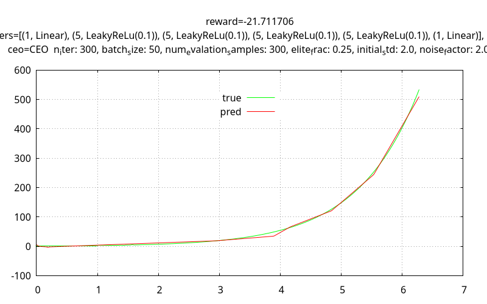

# wall-e

## description
- A neural-network controller for a differential-drive agent to reach a goal.
- A simple fully-connected network with ReLu activations is used as controller.
- Noisy cross-entroy optimizer (ceo), a gradient-less optimization method is used for network optimization.

## code
- The code is written in stable `rust`.
- A library named `wall-e` is implemented, which is used in the bin crates.
- The bin crates are the following
    - sin: fits sin function using ceo optmized neural-network.
    - exp: fits exp function using ceo optmized neural-network.
    - sim: provides a simulator for controlling differential-drive agent manually.
    - rl:  optimizes a neural-network controller for a differential-drive agent to reach a goal.
- The design of network, reward function and agent can be found in `report.pdf`.

## documentation
- The documentation of the code is itself.

## usage
- Install stable rust and cargo.
- Use `cargo run --release --bin rl sin` to fit a sin function.
- Use `cargo run --release --bin rl exp` to fit an exp function.
- Use `cargo run --release --bin rl sim` to start a simulator and control a differential-drive agent manually.
    - `up down` increases or decrease linesr speed.
    - `left right` change angular velocity.
    - `s` stop.
- Use `cargo run --release --bin rl` to run optimization, save the experiment and visualize it.
    - The saved file can be tweaked by hand to change the setting.
    - Ex. Spawn regions of agent and goal can be changed.
- Use `cargo run --release --bin rl <path-to-json>` to visualize experiment.
    - `r` respawn agent and goal.
    - `p` toggle play/pause simulator.
    - `pageup pagedown` change `dt` of simulation.

## demonstration

- Sin fitting.

- Exp fitting.

- The following video illustrates a few neural-network controlled differential-drive agents.

## roadmap
- Controller impl.
    - [x] Conv, Relu needed?
        - Probably not. Since for the input (x, y, th, xg, yg) probably there no local relations or sequential memory required.
        - A simple strategy would be to orient towards goal. True theta can be obtained by a function of (x, y, xg, yg). w and v can be given to reduce theta reside and distance residue.
    - [x] Variable number of dynamic dof layers.
    - [x] Per layer activations.
    - [x] Random param initialization.
    - [x] Make ceo() a struct.
    - [x] Seperate bin crate for each network.
    - Speedup
        - [x] Parallelize.
    - [x] sin().
    - [x] exp().
- Controller design.
    - Model.
        - [x] Input design & normalization.
        - [x] Hidden layer design.
        - [x] Output design.
        - [x] Param init design.
    - Reward function.
        - [x] Different reward functions.
        - [x] Randomized start poses.
        - [x] Randomized goals.
    - Optimizor.
        - [x] CEO.
    - Scenarios
        - [x] No obstacles.
    - Goal
        - [x] Position
        - [x] Should network determine stopping condition?
    - Simulator
        - [x] Interactive differential drive model.
        - [x] Constraints on controls.
- [x] Report and demo.

- Future work
    - [ ] Goal orientation
    - [ ] Wall boundaries.
    - [ ] Maybe move generation logic inside model? Removes into shapes a lot that way.
    - [ ] median().
    - [ ] Step level optimization vs Trajectory level optimization.
    - [ ] Known static obstacles.
